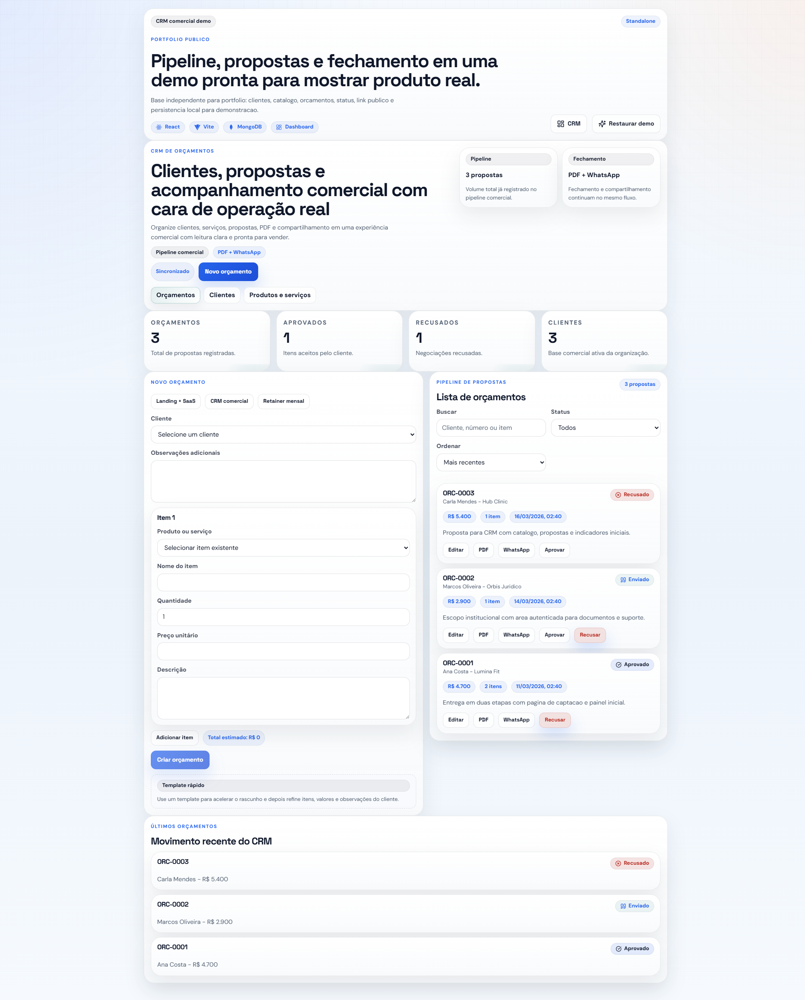

# CRM Comercial Fullstack Demo

Demo publica de CRM comercial para portfolio, com clientes, catalogo, orcamentos, status de proposta e link publico de compartilhamento.



## Destaques

- gestao de clientes
- catalogo de produtos e servicos
- criacao e edicao de orcamentos
- aprovacao e recusa de propostas
- link publico de proposta
- persistencia local com `localStorage`

## Stack

- React
- Vite
- React Router
- React Icons

## Como rodar

```bash
npm install
npm run dev
```

## Scripts

```bash
npm run lint
npm run build
```

## Estrutura principal

- `src/pages/Crm.jsx`: painel comercial principal
- `src/pages/PublicQuote.jsx`: tela publica da proposta
- `src/services/crmApi.js`: camada mock de dados e CRUD local
- `src/data/mockCrmSeed.js`: seed inicial da demo

## Observacoes

- Nao depende do produto privado principal.
- O botao `Restaurar demo` recompõe a base inicial.
- Preparado para deploy simples em Vercel.
